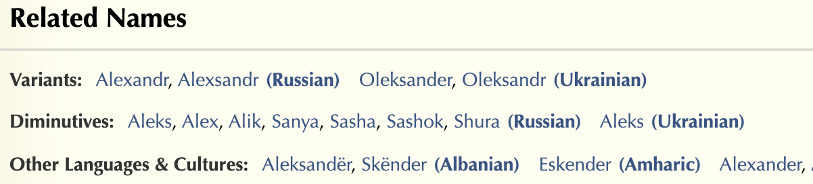

# OSINT Username generation guide

A definitive guide to generating usernames for OSINT/SOCMINT/Pentesting purposes.


## Table of Contents
- [Start](#start)
- [Combining Primary Info](#combining-primary-info)
  - [Addition of Personal Information](#addition-of-personal-information)
- [Primary Info Mining](#primary-info-mining)
- [Username Transformations](#username-transformations)
  - [Addition of Mail Domain](#addition-of-mail-domain)
- [Where to Check the Usernames](#where-to-check-the-usernames)
- [Covered SOWEL Techniques](#covered-sowel-techniques)
- [Other](#other)
  
## Start

Let's identify your goals.

If I understand correctly, **you have some information about people**, and you want to **get a list of usernames** (nicknames, just names), that may be used to search for those people.

Am I right? So, you're in the right place.

Below, you can find information on how to gather clues for a new search based on the data you already have, as well as how to automate the process and which tools to use.

### What do you have?

If you only have some information as a first name, a last name, a birthday (and, maybe some extra info), you should take a look at the section [“Combining primary info"](#combining-primary-info).

Do you need extra help to extend the number of likely usernames? For learning methods to get variants of first names and so on, check section [“Primary info mining”](#primary-info-mining).

If you have a username and want to guess similar usernames, jump to the [“Username transformations”](#username-transformations) section.

**Important!** Clone this repository with `git` or [download it](https://github.com/soxoj/username-generation-guide/archive/refs/heads/main.zip) to use the Python scripts mentioned below.

## Combining primary info

Usernames/logins commonly consist of a combination of a first name, a last name, and, a little less often, a middle name (patronymic). Only the first letters can be left, and some characters can separate parts (`_`, `.` and so on).

Of course, there can be many such combinations, so automation tools are needed. A good example is a very useful interactive [Google spreadsheet](https://docs.google.com/spreadsheets/d/17URMtNmXfEZEW9oUL_taLpGaqTDcMkA79J8TRw4xnz8/edit#gid=0) for email permutations from Rob Ousbey, from Distilled.net.


Here is an example of Email Permutator usage for `rob ousbey`:

```sh
rob@distilled.net
ousbey@distilled.net
robousbey@distilled.net
rob.ousbey@distilled.net
rousbey@distilled.net
...
```

A very useful service [NAMINT](https://seintpl.github.io/NAMINT/) offers various links for combinations of first, last and middle name (nickname):
- search engines (including photo search with Yandex)
- possible login patterns
- most popular social platforms search and supposed profile links
- Gravatars for logins at common email providers (great feature 🔥)


Also, you can find it convenient to use [Email Permutator](http://metricsparrow.com/toolkit/email-permutator/) from Metric Sparrow Toolkit or [analyzeid permutator](https://analyzeid.com/email-permutator/) with batch processing support.

For fans of a console, there are some specialized tools:

- Script [python-email-permutator](https://github.com/Satys/python-email-permutator) based on spreadsheet mentioned above.

- [Logins generator](https://github.com/c0rv4x/logins-generator) supporting flexible ways to combine first, last and middle names.

- [emailGuesser](https://github.com/WhiteHatInspector/emailGuesser) is a customizable permutator with the support of checks if an address is valid in Skype and in breach databases. 

- [username-anarchy](https://github.com/urbanadventurer/username-anarchy) generates usernames from a name in dozens of known formats (`anna.key`, `akey`, `k.anna`, and so on). It takes a single name, a file of names, or your own format string, and can generate names from a country dataset if you have no particular person in mind.

```sh
$ ./username-anarchy anna key
anna
annakey
anna.key
annakey
annak
a.key
akey
kanna
k.anna
...
```

If you have no particular person in mind, but need likely usernames for an organization (username enumeration, horizontal password attacks), there are ready-made lists:

- [statistically-likely-usernames](https://github.com/insidetrust/statistically-likely-usernames) - wordlists of the most common usernames in various formats (`jsmith`, `john.smith`, `jjs`, `johnsmith`, and the same as emails), ordered by frequency, so short lists already cover most of the users. Also contains base name lists to build your own formats and a DOB list generator.

  In which order to check? Generation is easy, but you quickly get thousands of candidates, and checking them all is expensive (and, against a login form, noisy). These lists are built exactly around that: name popularity follows a Pareto curve, so `jsmith` is worth far more than the thousandth name down. If you don't know the username format, start with the interleaved `awesome-mix-vol1.txt` (~25 800 entries mixing the most common formats) and only then `vol2.txt` (~49 400 more). Order your own generated list the same way: put the plain `firstname.lastname` / `jsmith` forms first and the exotic transformations (leetspeak, impersonation swaps) last, because those are what a real person picks only after the obvious login is taken.

- [SecLists](https://github.com/danielmiessler/SecLists) - the standard collection of wordlists for security testing. `Usernames/` contains common logins, service and test accounts, and `Usernames/Names/` contains first and last names by country (`familynames-usa-top1000.txt`, `forenames-india-top1000.txt`, `names-brazil-top100000.txt`), which is a good input for the permutators above.

Looking ahead, I will tell you that from lists of names you can [quickly make](#addition-of-mail-domain) a list of emails.

### Addition of personal information

If you have any other additional information, you can significantly expand the number of candidates for usernames. It can be a year of birth, city, country, profession, and... literally anything.

What can be used in this case?

- My own script based on ProtOSINT combination methods:

```sh
$ python3 generate_by_real_info.py
First name: john
Last name: smith
Year of birth: 1980
Username (optional):
Zip code (optional):
johnsmith1980
smith
johnsmith80
jsmith1980
smithjohn
...
```

[↑ Back to the start](#table-of-contents)

## Primary info mining

It can be very important to check all the variants of non-English usernames. For example, a person with the common name *Aleksandr* may have a passport with the name `Alexandr` (letter `x`) and a working login starting with `alexsandr` (letters `xs`) because of the different transliteration rules.

The same name can be spelled differently in a passport depending on which standard was applied: for Russian names the old GOST/FMS rules and the current ICAO Doc 9303 rules give different results (for example `Юлия` becomes `Yuliya` under the old rules and `Iuliia` under ICAO; see the [passport table](https://en.wikipedia.org/wiki/Romanization_of_Russian)). So it is worth generating logins from several transliterations of the same name, not just one.

Asian names are an even bigger source of variants, because several romanization systems coexist and the passport spelling often follows none of them:

- **Chinese**: mainland Pinyin vs older Wade-Giles vs Cantonese (Hong Kong) spellings - `李` is `Li` or `Lee`, `王` is `Wang` or `Wong`, `张` is `Zhang` or `Chang`. The given name may be joined, hyphenated or split (`Zedong` / `Ze-dong` / `Ze Dong`).
- **Japanese**: Hepburn vs Kunrei-shiki - `し` is `shi` or `si`, `つ` is `tsu` or `tu`, `ち` is `chi` or `ti`. Long vowels get spelled several ways too: `佐藤` can be `Sato`, `Satou` or `Satoh`.
- **Korean**: the official Revised Romanization vs the older McCune-Reischauer vs the conventional passport spelling - `김` is `Gim` by the standard but `Kim` on nearly every passport, `이` is officially `I` but written `Lee`, `박` is `Bak` but usually `Park`.

On top of that, in all three languages the family name comes first at home but is often flipped in Western contexts, so it is worth trying both orders. The practical takeaway is the same as above: generate logins from every plausible romanization, not just the one spelling you were given.

This is a source of variability for us, so let's use it.

- [BabelStrike](https://github.com/t3l3machus/BabelStrike) - a very powerful tool for normalization and generation of possible usernames out of a full names list. It supports romanization for Greek, Hindi, Spanish, French and Polish.


- [BehindTheName](https://www.behindthename.com/name/john) - excellent site about names. There are common name variants, diminutives (very useful for personal logins), and other languages alternatives.



You can use a simple script from this repo to scrape such data:
```sh
$ python3 behind_the_names.py john diminutives
Johnie
Johnnie
Johnny
```

- [WeRelate](https://www.werelate.org/wiki/Special:Names) - Variant names project, a comprehensive database of name variants with the ability to search. Gives much more results than BehindTheNames, but there are also many irrelevant results. Also, see [GitHub repo](https://github.com/tfmorris/Names) with project data.

[↑ Back to the start](#table-of-contents)

## Username transformations

When you sign up on the site it may turn out that your username is taken. Then you use a variant of a name - with characters replacement or additions.

Thus, making assumptions about the transformations and knowing the original name, you can check "neighbouring" accounts (for example, with [maigret](https://github.com/soxoj/maigret)).

I propose for this my own simple tool that allows you to make transformations by rules.

```sh
$ python3 transform_username.py --username soxoj rules/printable-leetspeak.rule
soxoj
s0xoj
5ox0j
50xoj
...
```

Rules for transformation are located in the directory `rules` and consist of the following:

- `printable-leetspeak.rule` - common leetspeak transformations such as `e => 3`, `a => 4`, etc.
- `printable-leetspeak-two-ways.rule` - the same conversions from letters to numbers, but also vice versa
- `impersonation.rule` - common mutations used by scammers-impersonators such as `l => I`, `O => 0`, etc.
- `impersonation-advanced.rule` - the same mutations, but applied regardless of the letter case, plus an `i => j` swap
- `additions.rule` - common additions to the username: underscores and numbers
- `toggle-letter-case.rule` - changing case of letters, what is needed not so often, but maybe useful
- `cyrillic.rule` - replacement of visually identical Cyrillic and Latin letters (`a`, `o`, `e`, `c`...), used both by impersonators and by people typing their name in the wrong layout
- `add_email.rule` - custom rule to add mail domain after usernames

You can use a file with a list of usernames:

```sh
$ cat usernames.txt
john
jack

$ python3 transform_username.py rules/impersonation.rule --username-list usernames.txt
jack
iack
john
iohn
...
```

And even use a pipe to use the output of other tools and itself, combining transformations:
```sh
$ python3 transform_username.py rules/printable-leetspeak.rule --username soxoj | python3 transform_username.py rules/impersonation.rule  -I
s0xOj
sOx0j
5OxOi
soxOj
sox0i
...
```

### Addition of mail domain

You can use `add_email.rule` and easily edit it to add needed mail domains to check emails in tools such as [mailcat](https://github.com/sharsil/mailcat), [holehe](https://github.com/megadose/holehe), or [GHunt](https://github.com/mxrch/GHunt).

```sh
$ python3 transform_username.py rules/printable-leetspeak.rule --username soxoj | python3 transform_username.py rules/add_email.rule --remove-known -I
soxoj@protonmail.com
sox0j@protonmail.com
s0x0j@protonmail.com
50x0j@protonmail.com
...
```

[↑ Back to the start](#table-of-contents)

## Covered SOWEL techniques

- [SOTL-8.2. Use Names Permutations](https://sowel.soxoj.com/names-permutations)
- [SOTL-8.3. Use Personal-Info-Based Identifiers](https://sowel.soxoj.com/personal-info-based-identifiers)

[↑ Back to the start](#table-of-contents)

## Where to check the usernames

You now have a list of names, logins and emails. The point of all this was to find accounts, so feed the list into tools that check many sites at once:

- [maigret](https://github.com/soxoj/maigret) - checks a username across 3000+ sites and pulls extra data (IDs, other accounts) from the pages it finds. Takes usernames as arguments or a whole list with `--input-file` (`-` reads stdin, so you can pipe the scripts above straight into it).
- [user-scanner](https://github.com/kaifcodec/user-scanner) - a 2-in-1 username and email checker (290+ username sites, 175+ email sites) that also scrapes profile metadata and pivots between usernames and emails. Takes a single input (`-u`/`-e`) or a file (`-uf`/`-ef`).
- [Sherlock](https://github.com/sherlock-project/sherlock) - the classic username checker across social networks, a good second opinion to maigret.
- [holehe](https://github.com/megadose/holehe) - tells you which sites a given email is registered on, without notifying the owner.
- [mailcat](https://github.com/sharsil/mailcat) - finds which of the common mail providers a username exists at (see [Addition of mail domain](#addition-of-mail-domain) for turning a name list into emails).

```sh
# check a list of usernames from a file
$ maigret --input-file usernames.txt

# or generate variants and check them in one go
$ python3 transform_username.py rules/additions.rule --username johnsmith | maigret --input-file -
```

[↑ Back to the start](#table-of-contents)

## Other

- [Good random names generator](https://github.com/epidemics-scepticism/NickGenerator)

[↑ Back to the start](#table-of-contents)
